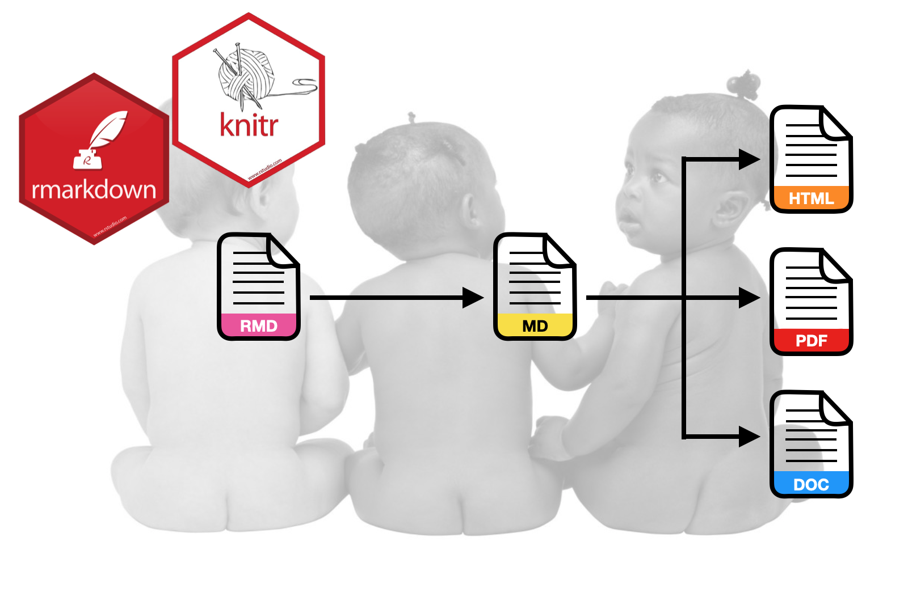

The goal of this assignment is to give you experience using RMarkdown to integrate analysis and documentation. In this assignment, you will use the data from the file *fertility.csv* to explain variation in infant mortality rates. 

- [[CSV]](https://raw.githubusercontent.com/zief0002/epsy-8252/master/data/fertility.csv)
- [[Data Codebook]](http://zief0002.github.io/epsy-8252/codebooks/fertility.html)


```{r echo=FALSE, out.width="50%", fig.align='center'}

```


## Instructions

**Create an R Markdown document to respond to each of the questions below.** Please adhere to the following guidelines for further formatting your assignment:

- All graphics should be resized so that they do not take up more room than necessary and should have an appropriate caption. Learn how to do this in a code chunk using [knitr syntax](http://yihui.name/knitr/).
- Any typed mathematics (equations, matrices, vectors, etc.) should be appropriately typeset within the document using Markdown's equation typesetting. See [here](http://www.calvin.edu/~rpruim/courses/m343/F12/RStudio/LatexExamples.html) for some examples of how mathematics can be typeset in R Markdown.
- All syntax should be hidden (i.e., not displayed) unless specifically asked for.
- Any messages or warnings produced (e.g., from loading packages) should also be hidden.

For each question, specify the question number (e.g., Question 2) using a level-2 (or smaller) header. Submit both the RMD and knitted HTML file. This assignment is worth 15 points.


<br />


## Questions

1. Import the data and display the first several rows of data (not all of it). Use one of the paged table options in your YAML to ensure that this is printed nicely. All syntax for these commands should be displayed, as should the output.

2. Create a well-formatted table that includes the mean infant mortality rate and the standard deviation of infant mortality rates for each region represented in the data. Display these in a summary table. All numerical output should be rounded to two decimal places. Also add an appropriate caption (the caption does not have to follow APA formatting). Do not display any syntax.

3. Recode the `gni_class` variable by creating a dummy variable called `high_gni`. In this dummy variable recode the two categories "Upper/Middle" and "Upper" to be 1, and recode "Low/Middle" and "Low" to be 0. Use the `lm()` function to fit a main effects linear model regressing infant mortality on your dummy variable and female education level. Use the `tidy()` function from the *broom* package to display the model's coefficient-level output. (Reminder: Do not display any syntax, only the model's coefficient-level output.)

4. Use a bulleted list to provide an interpretation of each estimated regression coefficient (including the intercept) from the regression you fitted in Question 3; one interpretation per list item.

5. Create a well-formatted table of the model's coefficient `tidy()` output (e.g., using the `kable()` function from the *knitr* package). In the final outputted table, the five column names should be "Predictor", "B", "SE", "t", and "p", respectively. All numerical output should be rounded to two decimal places, except the *p*-values, which should be rounded to three decimal places. Also add a caption. **(2pts.)**

6. Create a publication quality plot that displays the results from the fitted model. For this plot, put the female education level predictor on the *x*-axis. Display a separate line for each level of the dummy-coded GNI variable. The two lines should be displayed using different linetypes or colors (or both) so that they can be easily differentiated in the plot. Be sure that the figure includes a caption using the `fig.cap` option in the code chunk. The plot should be centered on the page. Adjust the aspect ratio of the plot using `fig.width` and `fig.height` in the code chunk so that it looks good. Lastly, change the values of the output width/height (`out.width`, `out.height`) to change the size of the plot from the default values. **(2pts.)**

7. Use a display equation to write the equation for the underlying *regression model* (including error and assumptions) using Greek letters, subscripts, and variable names. Also write the equation for the *fitted least squares regression equation* based on the output from `lm()`. Type these two equations in the same display equation, each on a separate line of text in your document, and align the equals signs. (Hint: Google "aligning math latex".) **(2pts.)**

8. Write the following sentence: "The estimated partial regression coefficient ($\hat\beta_\mathrm{Female~Education}$) is $x$." In this sentence, use an inline code chunk to replace $x$ with the value for the fitted coefficient from the fitted equation. In this code chunk, do not just write in the value for the coefficient, but use syntax to extract the value from the `tidy()` output. (Hint: Google "R extract element from dataframe".) **(2pts.)**

9. Compute the sum of squared residuals for the fitted regression. Although you can use the `anova()` function to check your work, compute this value by actually using R syntax to carry out the computation, $\sum(y_i - \hat{y}_i)^2$. Show the syntax you used in your document.

10. Write a sentence that includes two references in an inline citation. This should also generate the actual references when you knit your document. One of the two references should be the Fox textbook. The other should be a journal article of your choice. You can choose the topic of the sentence and how the two references are used in the citation. (Note the references do not actually have to pertain to what is written in the sentence. This is just an exercise in using the bibliography tools in Markdown.) The two references can be included in the document's YAML (be careful of the indentation) *or* drawn from an external BIB file. Specify an appropriate CSL file so that the references and citations are in APA format. (If you want to use a citation style that is different from APA, say for a specific journal, use the appropriate CSL file, and indicate that on the assignment.) **(2pts.)**
