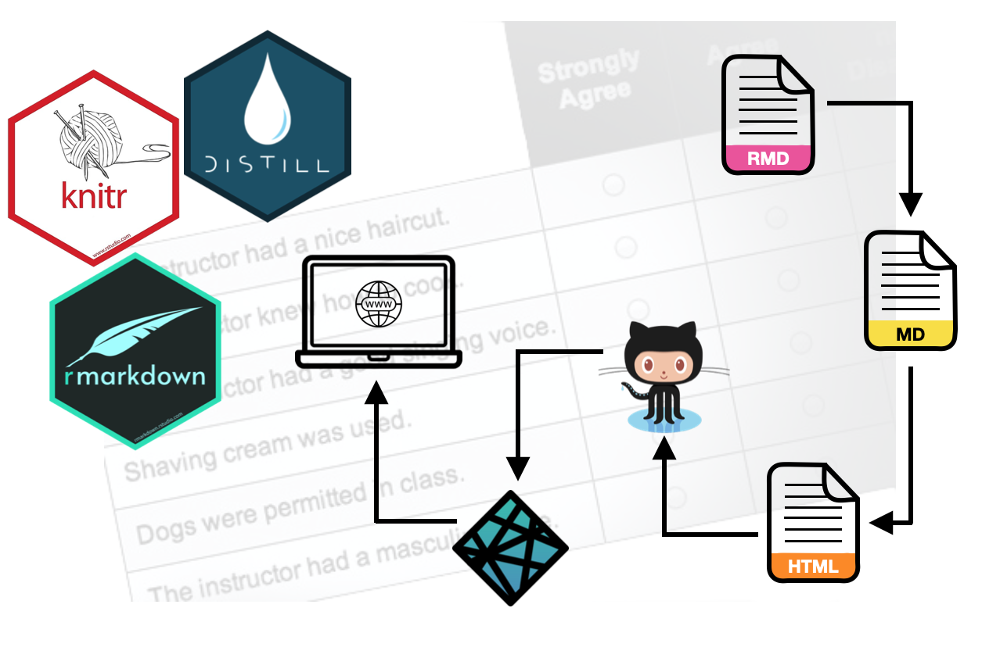

The goal of this assignment is to give you experience using probability distributions in a regression analysis. You will also obtain more experience using R Markdown. You will want to read the document *Probability Distributions in Regression*:

-  [[HTML]](https://zief0002.github.io/epsy-8252/notes/s22-05-probability-distributions-in-regression.html)
-  [[RMD]](https://raw.githubusercontent.com/zief0002/epsy-8252/master/docs/notes/s22-05-probability-distributions-in-regression.Rmd)

In this assignment, you will use the data from the file *evaluations.csv* to explain variation in students' course ratings. 

- [[CSV]](https://raw.githubusercontent.com/zief0002/epsy-8252/master/data/evaluations.csv)
- [[Data Codebook]](https://zief0002.github.io/book-8252/data-codebook.html#evaluations)


```{r echo=FALSE, out.width="50%", fig.align='center'}

```


## Instructions

**Create an R Markdown document to respond to Questions 1--10 below.** For each question, specify the question number (e.g., Question 2) using a level-2 (or smaller) header. 

- All graphics should be resized so that they do not take up more room than necessary and should have an appropriate caption. Learn how to do this in a code chunk using [knitr syntax](http://yihui.name/knitr/).
- Any typed mathematics (equations, matrices, vectors, etc.) should be appropriately typeset within the document using Markdown's equation typesetting. See [here](http://www.calvin.edu/~rpruim/courses/m343/F12/RStudio/LatexExamples.html) for some examples of how mathematics can be typeset in R Markdown.
- All syntax should be hidden (i.e., not displayed) unless specifically asked for.
- Any messages or warnings produced (e.g., from loading packages) should also be hidden.

Submit both the RMD and knitted HTML file. This assignment is worth 15 points.

<br />


# Part I: Model-Level Inference

Fit a regression model that uses professor's beauty rating, professor's age, and professor's sex to explain variation in course ratings. Do not trim this model; leave all predictors in the model whether they are statistically significant or not.


1. Write the equations (using mathematical notation) to compute the sum of squared model and sum of squared error in a single equation environment. Each equation should be on a separate line in the environment.

2. Use the partitioning from Question \#1 to compute the mean squares for the model and error. Show the syntax you used to compute these values along with your output. Indicate which mean square is being computed by commenting the syntax. 

3. Compute the observed *F*-statistic. Use an inline code chunk to present this in a sentence; "The observed *F*-statistic is [*insert R chunk*]"

4. Use the cumulative density functionality in R to find the *p*-value to test the null hypothesis $H_0:\rho^2=0$ using the observed *F*-value you computed in Question \#3. Show your syntax and output.

5. Create an ANOVA table that gives the model and error partitioning for the sum of squares and degrees of freedom. Also include the mean squares, the *F*-statistic and the *p*-value. Use `kable()` to make this table look good.  The formatting of this table will look similar to the output from the `anova()` function, except the partitioning will only be between model and error. (Hint: Try the `tidy_anova()` function from the `{educate}` package with the argument `model=TRUE`.)

<br />

# Part II: Coefficient-Level Inference

For all of the questions in Part II, use the partial effect of `age` from the fitted model.

6. Compute the observed *t*-statistic associated with the partial effect of age. Show your work via syntax.

7. Use the cumulative density function to find the *p*-value to test the hypothesis that $H_0:\beta_{\mathrm{Age}}=0$ using the observed *t*-value you computed in Question \#6. Show your work/syntax.

8. Create a plot of the probability density function of the *t*-distribution you used in Question \#7. Also shade the cumulative density associated with the *p*-value under this distribution. (Hint: This should look similar to Figure 4.3 in the *Probability Distributions* unit notes.) Only show the plot; do not show the syntax used to create it. **(2pts.)**

9. Compute the $t^{*}$ value that would be used to compute the 99% confidence interval for the effect of age. Show your work.

10. Use the value you computed in Question \#9 to compute the 99% confidence interval for the effect of age. Show your work.

<br />


# Part III: Rock a Personal Website

11. Create a personal website. Make it public. And share the URL with Andy. (Each person in your group will have to do this. Hard to have a "personal" website that is for the group. `r emo::ji("smiley")`) You can submit this URL anytime during the semester. **(3pts.)**

Your website doesn't have to be fancy. You can always make it spiffy later. Start small and add to it throughout your graduate career. It is a great place to share your work and writing a blog helps improve your writing. 

One of the simplest ways to do this with R is with the Distill and Postcards packages. Here is a [tutorial](https://distillery.rbind.io/posts/2021-03-16-postcards-distill/). Allison Hill has made a [YouTube video](https://www.youtube.com/watch?v=-ce-T48lR8A) walking through this process and also for serving it on Netlify. (She also has several other tutorials for using blogdown, bookdown, etc. on her [YouTube channel](https://www.youtube.com/channel/UCQYM-t2ut2zXr4d7TIFya1A/videos).) 


