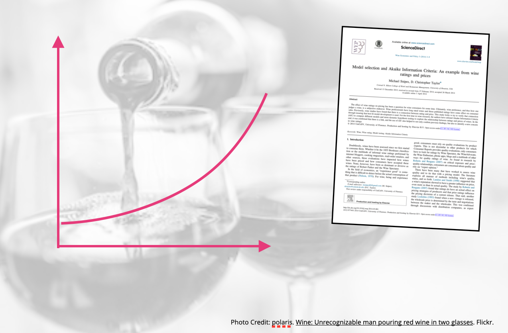

The goal of this assignment is to give you experience fitting, interpreting, and evaluating models with logarithmically transformed variables. 

In this assignment, you will use the data from the file *wine.csv* to examine several different predictors of wine rating (a measure of the wine's quality). The literature has suggested that price of wine is quite predictive of a wine's quality. You will be carrying out a replication study (using a different data set) of a study published by Snipes and Taylor (2014). 

- [[CSV]](https://raw.githubusercontent.com/zief0002/epsy-8252/master/data/wine.csv)
- [[Data Codebook]](http://zief0002.github.io/epsy-8252/codebooks/wine.html)


```{r echo=FALSE, out.width="50%", fig.align='center'}

```


## Instructions

Submit either an HTML file or, if you are not using R Markdown, a PDF file of your responses to the following questions. Please adhere to the following guidelines for further formatting your assignment:

- All graphics should be resized so that they do not take up more room than necessary and should have an appropriate caption.
- Any typed mathematics (equations, matrices, vectors, etc.) should be appropriately typeset within the document using Markdown's equation typesetting.
- All syntax should be hidden (i.e., not displayed) unless specifically asked for.
- Any messages or warnings produced (e.g., from loading packages) should also be hidden.

This assignment is worth 17 points.


<br />


## Model 1: Effect of Wine Rating on Price

1. Create and examine the scatterplot of the relationship between wine rating (predictor) and price. Include the loess smoother in this plot. Does this plot suggest any nonlinearity in the relationship between wine rating and price that we need to address?

2. Regress the log-transformed price variable (using the natural logarithm) on wine rating (Model 1). Report and interpret the slope coefficient (using the log-metric) from the fitted model.

3. Report and interpret the back-transformed slope coefficient from Model 1.

<br />

## Effect of Wine Rating and Region on Log-Transformed Price

Fit a model that includes the effects of wine rating and whether or not the wine is from France (i.e., region) to predict variation in the log-transformed price  (Model 2). 


4. Interpret the effect associated with region predictor (using the log-metric) from this model.

5. Report and interpret the back-transformed coefficient associated with region predictor from this model.


6. Use a set of likelihood ratio test to examine the partial effects of wine rating and region in Model 2. Provide the output of these tests in a table similar to that outputted by the `tidy()` function, but report the results from the LRT rather than the classical results in the `statistic` and `p.value` columns. Comment on whether both partial effects should be retained or whether the model can be reduced. **(2pts.)**

7. Fit a model that includes both the the wine rating and region (whether or not the wine is from France) main effects and the interaction effect to predict variation in the log-transformed price (Model 3). Evaluate this model by comparing it to Model 2 using a likelihood ratio test. Report the results of this test in prose (i.e., one or more sentences). Be sure to comment on which model you adopt. **(2pts.)**

<br />


## Adopting a "Final" Candidate Model

8. Based on all of the analyses you have done, which of the candidate models will you adopt as your "final" model? Write the fitted equation for the adopted candidate model.

9. Create and report a set of residual plots that allow you to evaluate the adopted model's assumptions. Are the assumptions for the model satisfied? Explain. **(2pts.)**


<br />


## Presenting the Results

10. Create a publication quality plot that displays the fitted curve(s) from your adopted candidate model. If you show more than one curve, each line should be easily differentiated in the plot. (Note: Make sure that you back-transform any log-transformed variables when you create this plot.) **(2pts.)**

11. Use the plot to help describe/interpret the effect of wine rating on price.

12. Re-create the plot of the standardized residuals versus the fitted values for your adopted model. Use the `{ggrepel}` package to include team labels. See [this article](https://ggrepel.slowkow.com/articles/examples.html) for examples. (Hint: If you are using the `augment()` function to create the residuals and fitted values, you will need to add a column that includes the wine names.) 

13. Based on your residual plot from Question 12, identify whether Rochioli Chardonnay is a good value (cheap wine) or bad value (expensive wine) relative to other *hypothetical wines* that have the same fitted value. Explain.

