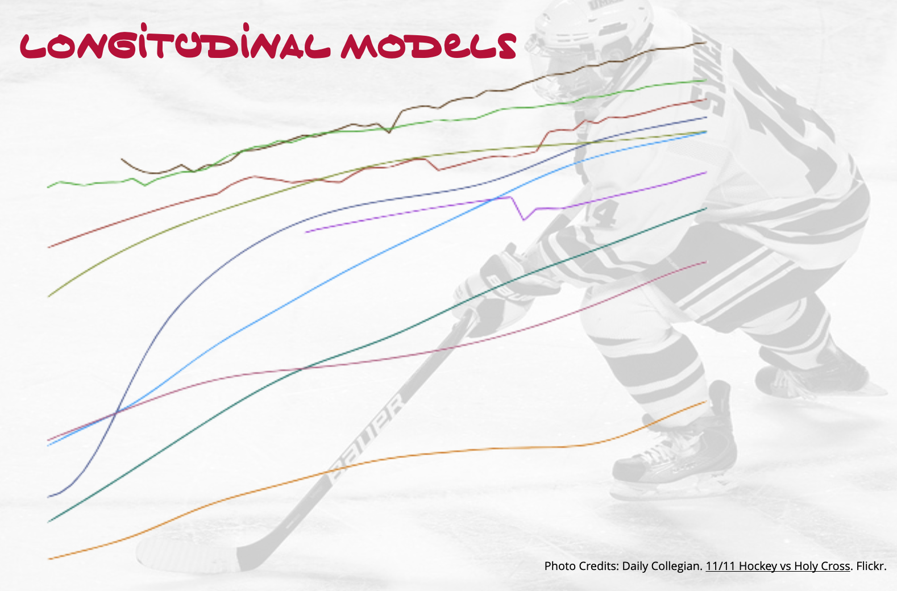

This goal of this assignment is to give you experience working with mixed-effects regression models to analyze longitudinal data. In this assignment, you will use the data from the file *nhl.csv* to examine longitudinal variation in cost of attending an NHL game.


- [[CSV]](https://raw.githubusercontent.com/zief0002/epsy-8252/master/data/nhl.csv)
- [[Data Codebook]](http://zief0002.github.io/epsy-8252/codebooks/nhl.html)


```{r echo=FALSE, out.width="50%", fig.align='center'}

```

## Instructions

If you are using R Markdown, submit both your RMD and HTML files of your responses to the following questions. If you are not using R Markdown, submit a PDF file of your responses to the following questions. Please adhere to the following guidelines for further formatting your assignment:

- All graphics should be resized so that they do not take up more room than necessary and should have an appropriate caption.
- Any typed mathematics (equations, matrices, vectors, etc.) should be appropriately typeset within the document using Markdown's equation typesetting.
- All syntax should be hidden (i.e., not displayed) unless specifically asked for.
- Any messages or warnings produced (e.g., from loading packages) should also be hidden.

This assignment is worth 13 points.


<br />


## Preparation

After importing the data set, create a new variable called `c_year` that centers the `year` values at 2002. In other words, the `c_year` variable will have a value of 0 when the `year` variable is 2002, a value of 1 when the `year` variable is 2003, etc. This variable will represent the number of years since 2002. 

For all analyses in this assignment, unless otherwise requested, use the `c_year` variable and not the `year` variable. 

<br />


## Data Exploration

1. Create and report a plot to display the cost of attending an NHL game (FCI) over time for each team (team profiles). In this plot, all teams should be in the same panel. Also add the profile based on the mean cost of attending an NHL game FCI over time. Make the teams' profiles slightly transparent so that the mean profile is easily visible.

2. Based on the average growth profile, describe how the average cost of attending an NHL game has changed over time. Your description of the growth pattern should allude to the functional form for the model.

<br />


## Fitting and Evaluating Models

Fit the following three models. For each of the growth models, include only a random-effect of intercept in the model. Use maximum likelihood estimation to fit all the models.

- **Model A:** Unconditional random intercepts model
- **Model B:** Unconditional linear growth model 
- **Model C:** Unconditional quadratic growth model


3. Create and report a table that includes the estimated variance components for each of the three fitted models.

4. Use the estimated variance components from Model A to determine the proportion of variation unaccounted for at the between- and within-team levels. Report these values.

5. Use the estimated variance components to determine the variation accounted for at the between- and within-team levels based on Model B. Report these values.

6. Which source of variation did Model B most account for? Explain why you would expect this based on the predictor included in Model B.

<br />

## Adopting and Evaluating an Unconditional Growth Model

7. Based on the AICc, which model (A, B, or C) has the most empirical evidence? Explain.

8. Create and report a density plot of the residuals and a scatterplot of the residuals versus the fitted values for the model you identified in Question 8. You can use the `augment()` function from `{broom.mixed}` to obtain both the fitted values (`.fitted`) and residuals (`.resid`). We evaluate these residual plots using the same methods we do when we fit an `lm()` model, so add any confidence envelopes, smoothers, or other guides to these plots that will aid in your evaluation.

9. Evaluate the assumptions of normality, homogeneity of variance, and that the average residual is equal to zero based on the plots you created in Question 9.


<br />

## Reporting the Results from the Adopted Model


10. Write the global fitted equation for the model you adopted in Question 7.

11. Write the team-specific fitted equation for the Minnesota Wild based on the model you adopted in Question 7.

12. Create a plot showing the predicted cost of attending an NHL game over time based on the global fitted model you reported in Question 10. Be sure to include a caption.

13. Add a line to the plot you created in Question \#12 (don't re-create the plot) showing the predicted cost of attending a Minnesota Wild game. Update the caption by adding an additional sentence to differentiate the Minnesota Wild curve from the global curve.


