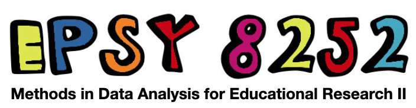
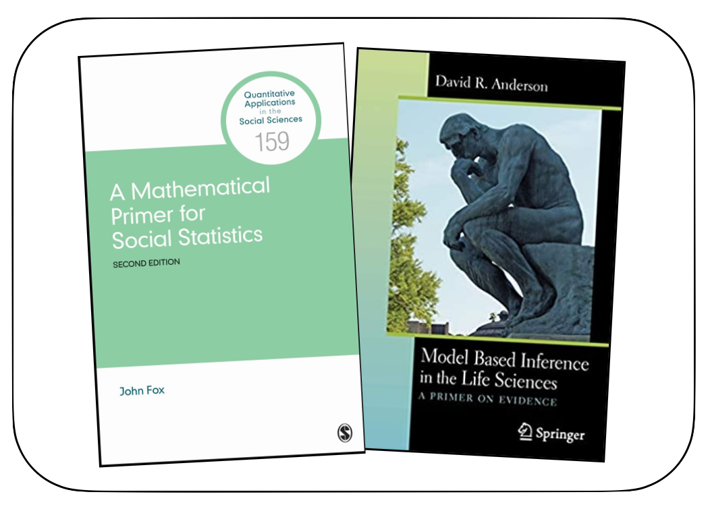

```{r knitr_init, echo=FALSE, cache=FALSE}
library(knitr)
library(rmdformats)
library(fontawesome)

## Global options
options(max.print = "75")

# Chunk options
opts_chunk$set(
  echo = FALSE,
	cache = TRUE,
  prompt = FALSE,
  tidy = TRUE,
  comment = NA,
  message = FALSE,
  warning = FALSE)

opts_knit$set(width = 75)
```


# Welcome to 8252 {-}




In this class, we will work together to develop a learning community that is inclusive and respectful, and where every student is supported in the learning process. As a class full of diverse individuals (reflected by differences in race, culture, age, religion, gender identity, sexual orientation, socioeconomic background, abilities, professional goals, and other social identities and life experiences) I expect that different students may need different things to support and promote their learning. The TAs and I will do everything we can to help with this, but as we only know what we know, we need you to communicate with us if things are not working for you or you need something we are not providing. I hope you all feel comfortable in helping to promote an inclusive classroom through respecting one another's individual differences, speaking up, and challenging oppressive/problematic ideas. Finally, I look forward to learning from each of you and the experiences you bring to the class. 


<br />

### Instructor {-}

Andrew Zieffler ([zief0002@umn.edu](mailto://zief0002@umn.edu)) <br />
<!-- **Virtual Office:** [Zoom](https://umn.zoom.us/my/zieffler)  <br /> -->
**Physical Office:** [Education Sciences Building 178](https://www.google.com/maps/place/Education+Sciences+Building/@44.9784043,-93.2394586,15z/data=!4m2!3m1!1s0x0:0x45656dac481b9150)  <br />
**Office Hours:** Tuesday 9:00 AM&ndash;10:00 AM; and by appointment <br />
**Virtual Office:** If you want to meet virtually, send me a Google calendar invite and include a Zoom link.

### Teaching Assistant {-}

Peter Li ([lixx1474@umn.edu](mailto://lixx1474@umn.edu))  <br />
**Physical Office:** [Education Sciences Building 193](https://www.google.com/maps/place/Education+Sciences+Building/@44.9784043,-93.2394586,15z/data=!4m2!3m1!1s0x0:0x45656dac481b9150)  <br />
**Office Hours:** Monday 9:00 AM&ndash;10:00 AM; Thursday 9:00 AM&ndash;10:00 AM; and by appointment

<br />


### Syllabus {-}

- The course syllabus is available  [here](https://github.com/zief0002/gentrified-ladybug/raw/main/syllabus/s22-8252-syllabus.pdf).
- [Message from Snoop Dogg](https://t.co/5X88O0DBUZ?amp=1) about the syllabus

<br />


### Class Meeting Times and Zoom Links {-}

- Tuesday/Thursday (11:15&ndash;12:30): [315 Peik Hall](https://campusmaps.umn.edu/peik-hall)
- Monday/Wednesday (2:30&ndash;3:45): [B80 Ford Hall](https://campusmaps.umn.edu/ford-hall)


<br />


### Textbooks {-}

<figure>
  
</figure>

The following textbook is required:

- Fox, J. (2009). [A mathematical primer for social statistics.](http://dx.doi.org.ezp1.lib.umn.edu/10.4135/9781412983228) Thousand Oaks, CA: Sage.

There is also an optional textbook:

- Anderson, D. R. (2008). [Model based inference in the life sciences: A primer on evidence.](http://login.ezproxy.lib.umn.edu/login?url=http://link.springer.com/10.1007/978-0-387-74075-1) New York: Springer.

<br />


### Prerequisites {-}

Prerequisites include *EPsy 8251: Methods in Data Analysis for Educational Research I*, or a sound conceptual understanding of the topics of: 

- Foundational topics in data analysis;
  + Design (e.g., random assignment and random sampling)
  + Descriptive statistics and plots
  + One- and two-sample tests
- Correlation;
- Simple regression analysis;
  + Model-level and coefficient-level interpretation
  + Ordinary least squares estimation
  + Model-level and coefficient-level inference
  + Assumption checking/residual analysis
- Multiple linear regression
  + Model-level and coefficient-level interpretation and inference
  + Assumption checking/residual analysis
  + Working with categorical predictors (including adjusting *p*-values for multiple tests)
  + Interaction effects

For the topics listed, students would be expected to be able to carry out an appropriate data analysis and properly interpret the results. It is also assumed that everyone enrolled in the course has some familiarity with using R. 

<br />

### Miscellaneous Resources {-}

Here are two resources that might be useful:

- [Computational Toolkit for Educational Scientists](https://zief0002.github.io/toolkit-quarto/)
- [Statistical Modeling and Computation for Educational Scientists](https://zief0002.github.io/modeling/)

<!-- ### Other QME Courses -->

<!-- If you are wondering what to take after EPsy 8252, there are many advanced courses offered by QME. The "flowchart" below indicates those offerings and also any other prerequisite courses you may need. Blurred out courses are not offered in 2020-21. (I created this from memory since those documents are at school.)  -->

<!-- - [QME Course Offerings](misc/qme-course-map-2020-04-29.pdf) -->

<!-- Advanced statistics courses are also offered in many other departments around campus, most notably in the Statistics Department, and in Public Health (Biostatistics).   -->


```{r child = 'schedule.Rmd'}
```

```{r child = 'assignments.Rmd'}
```

```{r child = 'data.Rmd'}
```

```{r child = 'readings.Rmd'}
```


