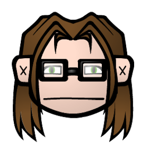

class: inverse, center, middle
background-image: url('figs/bg-title-slide.png')
background-size: cover
background-position: left top


# Andy



### A DAY IN THE LIFE

Andrew Zieffler | EPsy Research Colloquium | Spring 2022

???

Image credit: Hex stickers from https://github.com/rstudio/hex-stickers

---

layout: true

background-image: url('figs/goldy.png')
background-position: 95% 95%
background-size: 10%

---

name: about_me

# About Me

My name is Andy and I have three dogs.

---

<!-- class: middle, center -->
<!-- name: sadie -->

# I grew up in a family that valued education.

<!-- Sadie is a 10-year old sprollie; a springer spaniel/border collie mix. -->

<!-- <br /> -->


<!-- ??? -->

<!-- Sadie is white with black spots. -->

<!-- --- -->

<!-- name: hank -->

<!-- # Hank -->

<!-- Hank is a three-year old chi-weenie; a chihuahua/long-haired dachshund mix. -->

<!-- -- -->

<!--  -->

<!-- <!--  --> -->

<!-- -- -->

<!-- .right[Hello Hank] -->

<!-- ??? -->

<!-- Hank is brown with tan feet and chin. -->

<!-- --- -->

<!-- name: iggy -->

<!-- # Iggy -->

<!-- Ignatius Fauci Fortenberry (Iggy) is a 7-month old schnauzer/lab mix. -->

<!--  -->

<!-- <!--  --> -->

<!-- ??? -->

<!-- Iggy is black with white feet, a white chest, and a white goatee. -->

<!-- --- -->

<!-- layout: false -->
<!-- name: gardening -->

<!-- <!-- No logo from here on. --> -->

<!-- # Gardening -->

<!-- .pull-left[ -->
<!-- I like to garden. I have replaced most of the grass in my yard with paths and gardens. -->
<!-- ] -->


<!-- .pull-right[ -->
<!--  -->
<!-- ] -->

<!-- ??? -->

<!-- This is on the west side of our house. -->


<!-- --- -->

<!-- name: highlight_syntax -->

<!-- # Highlighting Syntax -->

<!-- ```{r message=FALSE} -->
<!-- # Load library -->
<!-- library(tidyverse) -->

<!-- # Find mean dist for each speed for speed<10 -->
<!-- cars %>% -->
<!--   filter(speed < 10) %>% -->
<!--   group_by(speed) %>% -->
<!--   summarize(M = mean(dist)) %>% -->
<!--   ungroup() #<< -->
<!-- ``` -->

<!-- --- -->

<!-- name: highlight_output -->

<!-- # Highlighting Output -->

<!-- ```{r message=FALSE, highlight.output=c(1,3)} -->
<!-- # Load library -->
<!-- library(tidyverse) -->

<!-- # Find mean dist for each speed for speed<10 -->
<!-- cars %>% -->
<!--   filter(speed < 10) %>% -->
<!--   group_by(speed) %>% -->
<!--   summarize(M = mean(dist)) %>% -->
<!--   ungroup() -->
<!-- ``` -->


<!-- --- -->

<!-- name: plot_example -->

<!-- # A Plot -->

<!-- ```{r echo=FALSE, fig.align='center', fig.cap="Scatterplot of stopping distance versus speed.", out.width="60%", fig.retina=3} -->
<!-- # Create plot -->
<!-- ggplot(data = cars, aes(x = speed, y = dist)) + -->
<!--   geom_point() + -->
<!--   xlab("Speed") + -->
<!--   ylab("Stopping distance") + -->
<!--   theme_light() -->
<!-- ``` -->


<!-- --- -->

<!-- name: code_first -->

<!-- # Code First; Plot Second -->

<!-- .pull-left[ -->

<!-- ```{r plot-last, fig.show = 'hide'} -->
<!-- # Create plot -->
<!-- ggplot(data = cars, aes(x = speed, y = dist)) + -->
<!--   geom_point() + -->
<!--   xlab("Speed") + -->
<!--   ylab("Stopping distance") + -->
<!--   theme_minimal() -->
<!-- ``` -->
<!-- ] -->

<!-- .pull-right[ -->
<!-- ```{r ref.label = 'plot-last', echo = FALSE} -->
<!-- ``` -->
<!-- ] -->


<!-- --- -->

<!-- name: plot_first -->

<!-- # Plot First; Code Second -->

<!-- .pull-left[ -->

<!-- ```{r plot-first, echo = FALSE} -->
<!-- ggplot(data = cars, aes(x = speed, y = dist)) + -->
<!--   geom_point() + -->
<!--   xlab("Speed") + -->
<!--   ylab("Stopping distance") + -->
<!--   ggthemes::theme_economist_white() -->
<!-- ``` -->
<!-- ] -->

<!-- .pull-right[ -->
<!-- ```{r ref.label = 'plot-first', eval = FALSE} -->
<!-- ``` -->
<!-- ] -->


<!-- --- -->

<!-- layout: true  <!-- Two logos on this slide. --> -->

<!-- background-image: url(figs/goldy.png), url(figs/goldy.png), url(figs/goldy.png) -->
<!-- background-position: 95% 95%, 95% 5%, 5% 95% -->
<!-- background-size: 10%, 20%, 30% -->
<!-- name: table -->

<!-- # A Table -->


<!-- ```{r message=FALSE, echo=FALSE} -->
<!-- # Load libraries -->
<!-- library(knitr) -->
<!-- library(kableExtra) -->

<!-- # Create table -->
<!-- cars %>% -->
<!--   head() %>% -->
<!--   kable( -->
<!--     format = "html", -->
<!--     col.names = c("Speed", "Distance"), -->
<!--     caption = "<b>Table 1.</b>  <i>Speed and stopping distance for the first six observations.</i>", -->
<!--     table.attr = "style='width:40%;'" -->
<!-- ) %>% -->
<!--   kable_classic() -->
<!-- ``` -->

<!-- --- -->

<!-- name: extra_slide -->

<!-- # Extra Slide -->

<!-- Just a new slide. -->

<!-- --- -->

<!-- background-image: url(figs/mn-flower.jpg) -->
<!-- background-position: center -->
<!-- background-size: cover -->
<!-- class: center, middle -->
<!-- name: background_image -->

<!-- # Background Image -->

<!-- Background Size = cover -->


