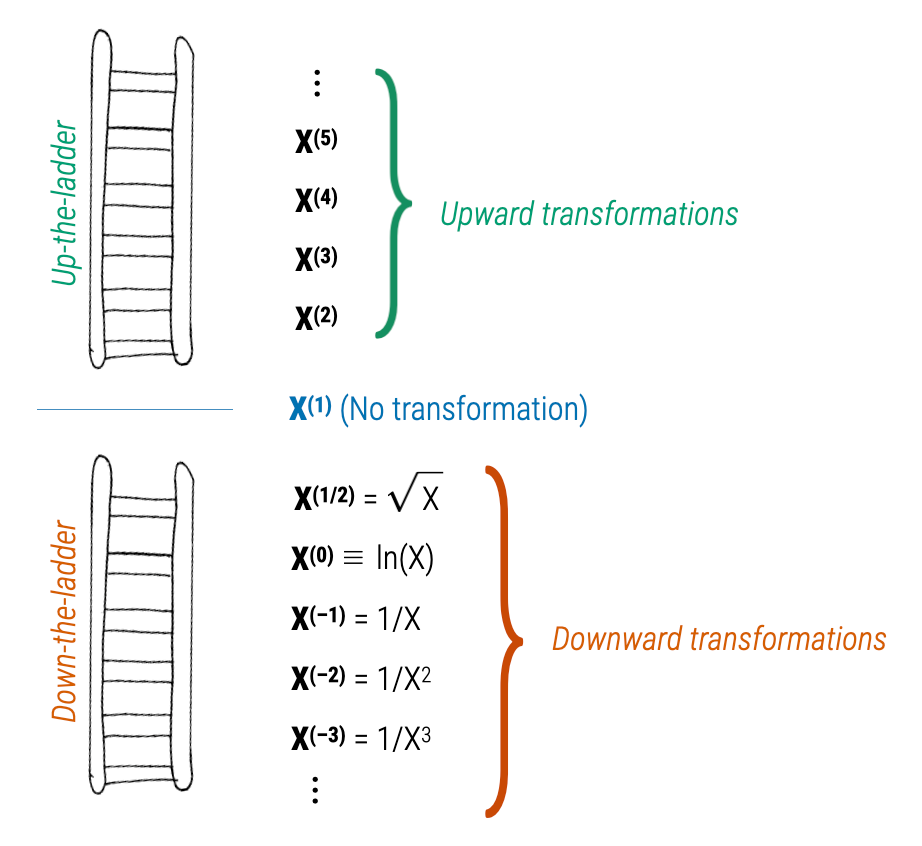

<script id="MathJax-script" async
  src="https://cdn.jsdelivr.net/npm/mathjax@2.7.5/es5/tex-mml-chtml.js">
</script>


```{r knitr_init, echo=FALSE, cache=FALSE, message=FALSE}
library(knitr)
library(kableExtra)
library(rmdformats)
library(patchwork)
library(tidyverse)

## Global options
options(
  max.print = "75",
  scipen = 5,
  knitr.kable.NA = '' #Make NAs blank in kable() output
  )

## knitr document chunk options
opts_chunk$set(
  prompt = FALSE, 
  comment = NA, 
  message = FALSE, 
  warning = FALSE, 
  tidy = FALSE, 
  fig.width = 6, 
  fig.height = 6,
  fig.align = 'center', 
  out.width='40%'
  )

## Set output width for printing
opts_knit$set(width = 85)
```

In this set of notes you will learn about power transformations, how to use power transformations to re-express data so that the re-expressed data meet the assumption of "linearity" (i.e., straighten" curvilinear data), and see this in an empirical example.

<br />

## Power Transformations

All of the transformations, or re-expressions, of data we have seen in this course are power transformations. Power transformations essentially transform some variable *X* using the function:

$$
X \rightarrow X^{(p)}
$$

where *p* is some power. Here are some important ideas about power transformations:

- If we let $p=1$, this transformation maps *X* to *X* (no transformation).'
- We refer to transformations where $p>1$ as *upward transformations*.
- We refer to transformations where $p<1$ as *downward transformations*.
- Since the transformation using $p=0$ would be pointless (it would transform all the *X*-values to 1), we attribute $p=0$ as the log-transformation.

This is called the *ladder of transformations*, since we can think about these different power transformations as a ladders going up or down from the $p=1$ (no transformation) starting point.

```{r out.width='70%', fig.cap="Ladder of transformations indicating upward (up-the-ladder) power transformations and downward (down-the-ladder) power transformations.", echo=FALSE}

```


## Rule of the Bulge

The *Rule of the Bulge* is a technique introduced by John Tukey and Frederick Mosteller for "straightening" data to better meet the assumption of linearity. Note that the following figure shows the four monotonic curves; one in each of the four quadrants:

```{r out.width='70%', fig.cap="Ladder of transformations indicating upward (up-the-ladder) power transformations and downward (down-the-ladder) power transformations.", echo=FALSE}
include_graphics("figs/rule-of-the-bulge.png")
```


The Rule of the Bulge tells us:

- If the data have a shape similar to that shown in the **Quadrant 1**, then the data analyst can try to re-express the variables by using an upward transformation of *X* (up-the-ladder), an upward transformation of *Y*, or both.
- If the data have a shape similar to that shown in the **Quadrant 2**, then the data analyst can try to re-express the variables by using a downward transformation of *X* (down-the-ladder), an upward transformation of *Y* (up-the-ladder), or both.
- If the data have a shape similar to that shown in the **Quadrant 3**, then the data analyst can try to re-express the variables by using a downward transformation of *X* (down-the-ladder), a downward transformation of *Y*, or both.
- If the data have a shape similar to that shown in the **Quadrant 4**, then the data analyst can try to re-express the variables by using an upward transformation of *X* (up-the-ladder), a downward transformation of *Y* (down-the-ladder), or both.

To illustrate, consider the the non-linear relationships depicted in the following two scatterplots. 

```{r fig.width=8, fig.height=4, out.width="80%", class.source = 'fold-hide'}
# Import data
mn = readr::read_csv(file = "https://raw.githubusercontent.com/zief0002/epsy-8252/master/data/mn-schools.csv")
fert = readr::read_csv(file = "https://raw.githubusercontent.com/zief0002/epsy-8252/master/data/fertility.csv")

# Create scatterplot of graduation data
p1 = ggplot(data = mn, aes(x = sat, y = grad)) +
  geom_point() +
  geom_smooth(method = "loess", se = FALSE) +
  theme_light() +
  xlab("Estimated median SAT score (in hundreds)") +
  ylab("Six-year graduation rate")

# Create scatterplot of fertility data
p2 = ggplot(data = fert, aes(x = educ_female, y = infant_mortality)) +
    geom_point() +
    geom_smooth(se = FALSE) +
    xlab("Average female education level") +
    ylab("Infant mortality rate (per 1,000 live births") +
    theme_light()

# Layout plots
p1 | p2
```


The scatterplot of the relationship between median SAT scores and graduation rate indicates a relationship similar to that in Quadrant 2. This suggests that we could try to: (1) Re-express *X* using a downward transformation; (2) re-express *Y* using an upward transformation, or (3) both. In the notes, we fitted a model in which we log-transformed the median SAT scores (downward transformation of *X*) to "straighten" the relationship,

```
Y ~ 1 + ln(X)
```

The scatterplot of the relationship between female education level and infant mortality rate indicates a relationship similar to that in Quadrant 3. This suggests that we could try to: (1) Re-express *X* using a downward transformation; (2) re-express *Y* using a downward transformation, or (3) both. Below is the plot in which we re-expressed infant mortality rate using a log-teansform (downward transformation.)

```
ln(Y) ~ 1 + X
```


```{r class.source = 'fold-hide'}
ggplot(data = fert, aes(x = educ_female, y = log(infant_mortality))) +
    geom_point() +
    geom_smooth(se = FALSE) +
    xlab("Average female education level") +
    ylab("ln(Infant mortality rate)") +
    theme_light()
```


<br />


## Caution `r emo::ji("warning")`

Sometimes these re-expressions will not be adequate. In some cases, you might not be able to "straighten" the data enough to meet the assumption. This is because these transformations "deteriorate" or "spuriously increase" the information contained in the data. As you use re-expressions further down-the-ladder, the variation in the re-expressed data decreases (Less variation = less information). Eventually, the variation in the re-epressed data will be so small that the values become indistinguishable (no information). 

In the other direction, as you use re-expressions further up-the-ladder, the variation in the re-expressed data increases (more variation = more information), albeit spuriously. Essentially, we are adding information that is not truly in the data. This might lead us to finding results that aren't really there, or over-emphasizing relationships.

:::fyi
Re-expressions that only go a little way up- or down-the-ladder are fine. Just beware if you need to go too far up- or down-the-ladder to straighten your data. In those cases you may want to use a different method of estimating the model than OLS (e.g., non-linear least squares).
:::

<br />

## Empirical Example

We will use the *mammals.csv* data to predict variation in body weight for mammals using their brain weight as a predictor.

```{r setup}
# Load libraries
library(broom)
library(tidyverse)

# Import data
mammal = read_csv("https://raw.githubusercontent.com/zief0002/epsy-8252/master/data/mammal.csv")
head(mammal)

# Examine relationship
ggplot(data = mammal, aes(x = brain_weight, y = body_weight)) +
  geom_point() +
  geom_smooth(se = FALSE) +
  theme_light() +
  xlab("Brain weight (in g)") +
  ylab("Body weight (in kg)")
```

The relationship is non-linear, and shows an exponential growth curve. Use the Rule of the Bulge mnemonic, we identify this curve in the lower right-hand quadrant. To help straighten this curve we can either:

- Transform *X* using an upward transformation; or
- Transform *Y* using a downward transformation

Since there is only a single predictor, transforming *Y* is low-cost (it doesn't affect the relationship between *Y* and other predictors), whereas transforming *X* with an upward transformation means we would have to include more than one effect in the model (e.g., $X$ and $X^2$). 

Because of this I will transform *Y* using the log-transformation. Looking at the relationship between ln(body weight) and brain weight, we will see if this "straightened" the relationship.

```{r}
ggplot(data = mammal, aes(x = brain_weight, y = log(body_weight))) +
  geom_point() +
  geom_smooth(se = FALSE) +
  theme_light() +
  xlab("Brain weight (in g)") +
  ylab("ln(Body weight)")
```

The relationship is non-linear, and shows a decay version of the exponential growth curve. Use the Rule of the Bulge mnemonic, we identify this curve in the upper left-hand quadrant. To help straighten this curve we can either:

- Transform *X* using an downward transformation; or
- Transform *Y* using an upward transformation

Since we just used a downward transformation on *Y* to fix the last relationship, using an upward transformation now would just re-introduce the initial problem. Because of this I will transform *X* using the log-transformation. Looking at the relationship between ln(body weight) and ln(brain weight), we will see if this "straightened" the relationship.

```{r}
ggplot(data = mammal, aes(x = log(brain_weight), y = log(body_weight))) +
  geom_point() +
  geom_smooth(se = FALSE) +
  theme_light() +
  xlab("ln(Brain weight)") +
  ylab("ln(Body weight)")
```

This relationship looks linear! So we can fit a linear model that uses ln(brain weight) to predict variation in ln(body weight). We can then use back-transformations and a plot of the fitted equation to interpret the coefficients in the model.

<br />


## Fit Linear Model

Fitting the linear model and looking at it's output:

```{r}
# Fit model
lm.1 = lm(log(body_weight) ~ 1 + log(brain_weight), data = mammal)

# Model-level output
glance(lm.1)

# Coefficient-level output
tidy(lm.1)
```

Interpreting this output:

- Differences in mammals' brain weight explain 92.1% of the variation in body weight.

The fitted equation is:

$$
\hat{\ln(\mathrm{Body~Weight})}_i = -2.51 + 1.22\bigg[\ln(\mathrm{Brain~Weight}_i)\bigg]
$$

- Mammals with a log(brain weight) of 0 have a predicted log(body weight) of $-2.51$, on average.
- Each one-unit change in log(brain weight) is associated with a change in log(body weight) of 1.22-units, on average.

We can also back-transform these log entities to get a better interpretation of the coefficients. For the intercept, when log(brain weight) is 0, actual brain weight = 1. Thus, mammals with a 1-gram brain weight have a predicted log(body weight) of $-2.51$, on average. Exponentiating this ($e^{-2.51}=0.081$), so we can interpret the intercept as:

- Mammals with a brain weight of 1 gram have a predicted body weight of 0.081 kg, on average.

To consider the interpretation of the slope, we utilize the fact that log-transforming *X* (using the natural logarithm) results in an interpretation that can be interpreted as a 1% change in *X*. As such, we choose a series of brain weights that differ by 1% and plug them into our fitted equation to get predicted log(body weights):

```{r}
# Choose brain weights that differ by 1%
body = c(100, 101, 102.01)

# Get predicted ln(body weight) values
-2.51 + 1.22 * log(body)
```

The interpretation is:

- Each 1% difference in brain weight is associated with a difference of 0.012 in log(body weight), on average.

Here 0.012 is the slope coefficient divided by 100. Now let's transform the log(body weight) values to raw body weights. To do this, we exponentiate these predicted values:

```{r}
# Exponentiate the predicted values
exp(-2.51 + 1.22 * log(body))
```

This results in a constant multiplicative difference of 1.0122, Namely,

- Each 1% difference in brain weight is associated with a 1.012-fold difference in body weight, on average.

Or, interpreting this as a percent change:

- Each 1% difference in brain weight is associated with a 1.22% difference in body weight, on average.

This 1.22% change is essentially the slope coefficient from the fitted equation. Thus when we log-transform both *X* and *Y* using the natural logarithm, we can interpret both the change in *X* and change in *Y* as a percent change. In general:

- Each 1% difference in *X* is associated with a $\hat\beta_1$% difference in *Y*, on average.

We can also plot the fitted curve to facilitate a graphical interpretation.

```{r}
# Plot fitted curve
ggplot(data = mammal, aes(x = brain_weight, y = body_weight)) +
  geom_point(alpha = 0.2) +
  geom_function(fun = function(x){exp(-2.509 + 1.225*log(x))}) +
  theme_light() +
  xlab("Brain weight (in g)") +
  ylab("Body weight (in kg)")
```


